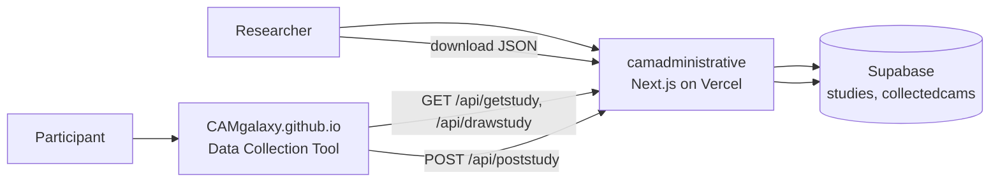

# Administrative Panel (camadministrative)

The **Cognitive-Affective Maps _Extended Logic_** administrative panel is a Next.js web application for setting up CAM studies, managing participant links, and collecting submitted data. The live site is served at [https://drawyourminds.de/](https://drawyourminds.de/).

This repository is the **source of truth** for the administrative panel. It is deployed to [Vercel](https://vercel.com/) and connected to a [Supabase](https://supabase.com/) backend.

## Getting Started

For recommendations and workflow guidance on using the Administrative Panel, please refer to the [online documentation](https://camtools-documentation.readthedocs.io/en/master/Set%20up%20study/).

## What this app does

The administrative panel covers the researcher-facing workflow end to end:

- **Authentication:** Register, log in, and manage accounts via Supabase Auth.
- **Study setup:** Create studies, define the default CAM, and store the study configuration (`configcam`, `defaultcam`, redirect link).
- **Participant links:** Generate links that open the [Data Collection Tool](https://camgalaxy.github.io) with the correct study settings.
- **Data collection:** Receive finished CAMs from participants and view or download them from the dashboard.

For the full user workflow (screenshots, step-by-step), see the [Set up study](https://camtools-documentation.readthedocs.io/en/master/Set%20up%20study/) documentation.

## Architecture



**Frontend:** Next.js 16 (App Router), React 18, TypeScript, Tailwind CSS, Material Tailwind, Recharts.

**Backend:** Supabase Postgres and Auth. Server Components, Server Actions, and Route Handlers in `app/` read and write study data.

**Sessions:** `@supabase/ssr` manages cookie-based auth via [`middleware.ts`](middleware.ts) and the helpers in [`utils/supabase/`](utils/supabase/).

**Cross-origin API access:** CORS headers for `/api/*` are configured in [`next.config.js`](next.config.js) so the static Data Collection Tool on GitHub Pages can call the API.

## API routes (Data Collection integration)

These serverless routes connect the [Data Collection Tool](https://github.com/CAM-E-L/DataCollection) to Supabase:

| Route | Purpose |
|-------|---------|
| `GET /api/getstudy?study=...` | Load study config and default CAM for a participant session ([`app/api/getstudy/route.ts`](app/api/getstudy/route.ts)) |
| `GET /api/drawstudy?study=...&participantID=...` | Load config plus an existing drawn CAM (researcher or participant view) ([`app/api/drawstudy/route.ts`](app/api/drawstudy/route.ts)) |
| `POST /api/poststudy` | Store a finished CAM in `collectedcams` ([`app/api/poststudy/route.ts`](app/api/poststudy/route.ts)) |

Participant links point to `camgalaxy.github.io` with a `link` parameter that resolves to these API endpoints.

## Supabase schema (overview)

Two tables are used by the application code:

| Table | Key fields | Role |
|-------|------------|------|
| `studies` | `namestudy`, `configcam`, `defaultcam`, `redirectlink`, `email` | Study definitions owned by a researcher |
| `collectedcams` | `camid`, `namestudy`, `cam`, `datestart`, `dateend`, `numconcepts`, `numconnectors`, `avgvalence` | Submitted participant CAMs |

Row-level security and additional columns are configured in the Supabase project (not in this repository).

## Project layout

| Path | Role |
|------|------|
| [`app/`](app/) | Pages (dashboard, login, register, study views) and API route handlers |
| [`components/`](components/) | UI components (headers, buttons, dashboard widgets) |
| [`utils/supabase/`](utils/supabase/) | Supabase client helpers for browser, server, and middleware |
| [`public/`](public/) | Static assets |

## Prerequisites

- Node.js **24.x** (see `engines` in [`package.json`](package.json))
- A Supabase project with the required tables and auth configured

Check that Node.js and npm are installed:

```bash
node --version
npm --version
```

## Run locally

```bash
git clone https://github.com/FennStatistics/camadministrative.git
cd camadministrative
npm install
```

Create a `.env.local` file in the project root:

```
NEXT_PUBLIC_SUPABASE_URL=<your-supabase-project-url>
NEXT_PUBLIC_SUPABASE_ANON_KEY=<your-supabase-anon-key>
```

Both values are available in your [Supabase project API settings](https://app.supabase.com/project/_/settings/api).

Start the development server:

```bash
npm run dev
```

Open the URL printed in the terminal (usually `http://localhost:3000`).

Other scripts:

```bash
npm run build   # production build
npm run start   # run production build locally
```

## Deploy

The public deployment runs on Vercel:

- [https://camadministrative.vercel.app/](https://camadministrative.vercel.app/)

Set `NEXT_PUBLIC_SUPABASE_URL` and `NEXT_PUBLIC_SUPABASE_ANON_KEY` as environment variables in the Vercel project (manually or via the Supabase Vercel integration).

## Official documentation

- [Set up a study](https://camtools-documentation.readthedocs.io/en/master/Set%20up%20study/) — researcher workflow for the administrative panel
- [CAM tools documentation](https://camtools-documentation.readthedocs.io/) — full software package overview
- [CAM-E-L on GitHub](https://github.com/CAM-E-L) — Data Collection, Data Analysis, and related repositories

## Need Help?

We're happy to assist with any additional questions or ideas you may have. Feel free to reach out:

- 📧 **Email us:** [cam.contact@drawyourminds.de](mailto:cam.contact@drawyourminds.de)
- 💬 **Join our community channel:** [Support Page](https://camtools-documentation.readthedocs.io/en/master/Support/)

## Acknowledgments

This software has been developed by:

- **Julius Fenn**

## Citation

If you use this software, please cite our article:

> Fenn, J., Gouret, F., Gorki, M., Reuter, L., Gros, W., Hüttner, P., & Kiesel, A. (2025). Cognitive-affective maps extended logic: Proposing tools to collect and analyze attitudes and belief systems. _Behavior Research Methods, 57_(6), 174. https://doi.org/10.3758/s13428-025-02699-y

BibTeX:

```bibtex
@article{fenn2025camel,
  author  = {Fenn, Julius and Gouret, Florian and Gorki, Michael and Reuter, Lisa and Gros, Wilhelm and H{\"u}ttner, Paul and Kiesel, Andrea},
  title   = {Cognitive-affective maps extended logic: Proposing tools to collect and analyze attitudes and belief systems},
  journal = {Behavior Research Methods},
  year    = {2025},
  volume  = {57},
  number  = {6},
  pages   = {174},
  doi     = {10.3758/s13428-025-02699-y},
  url     = {https://doi.org/10.3758/s13428-025-02699-y}
}
```
